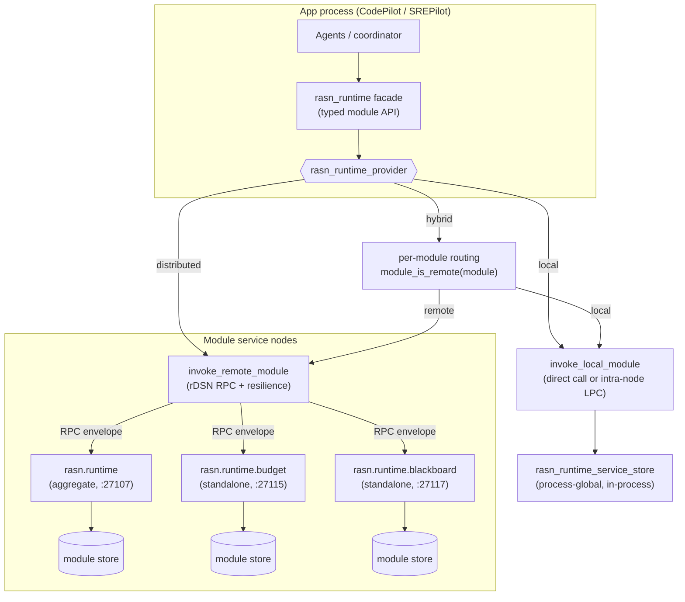
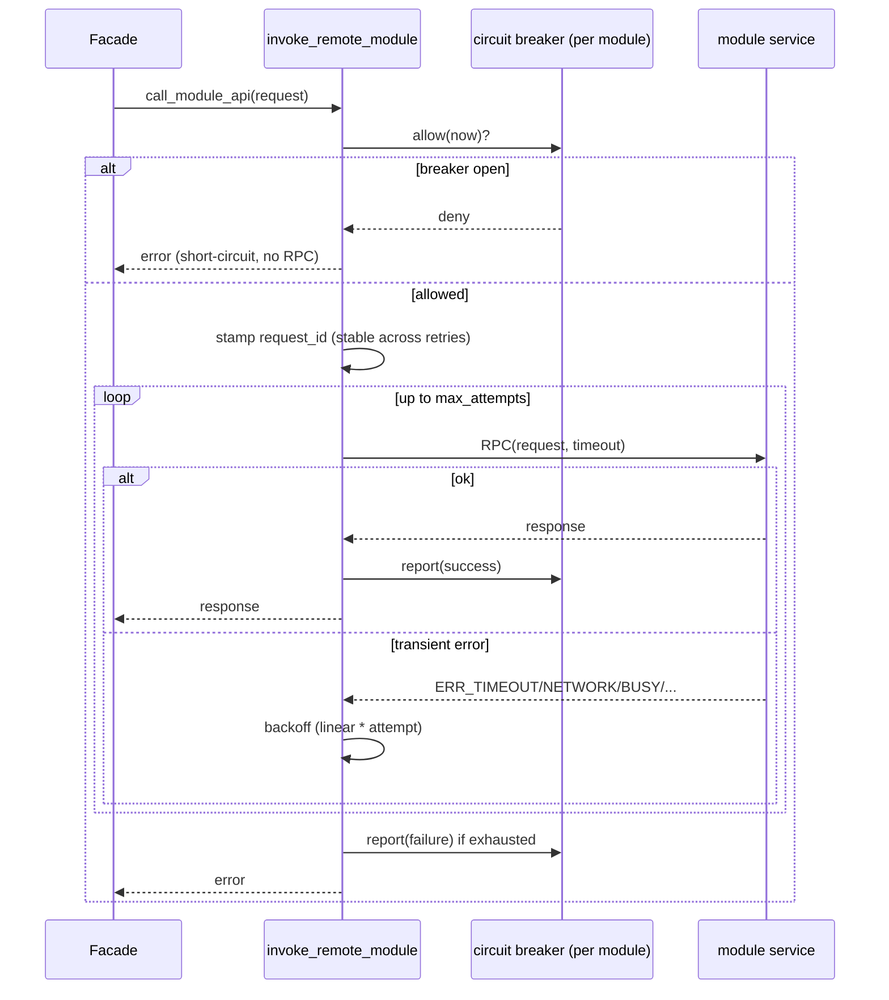

# Distributed rASN runtime

This document is the design for the rASN **runtime**: the layer that hosts
the eleven shared modules every pilot (CodePilot, SREPilot, …) depends on, and
makes them deployable either in-process or as distributed services across one or
many rDSN nodes.

It captures the architecture, the provider model, the request/response contract,
the resilience and consistency policies, and the multi-node roadmap. For the
broader rASN design see [DESIGN.md](DESIGN.md); for operator-facing configuration
and the module/port table see the "Distributed rASN runtime modules" section of
[../README.md](../README.md).

## 1. Motivation

The rASN runtime modules (agent control plane, message bus, task orchestration kernel,
determinism ledger, capability directory, resource budget, recovery supervisor,
blackboard, contract verifier, human interaction, sandbox runtime) started life
as plain C++ objects embedded in the CLI process. That is fine for a single-process
prototype but does not match the intended rASN architecture, where:

- apps should talk to shared services through a **runtime/provider API**, not by
  reaching into module objects, and
- modules should be **independently deployable** so a cluster can scale, isolate,
  and place them per workload.

The rASN runtime turns that module layer into an rDSN-native, provider-selected
service tier that apps consume through one stable facade.

## 2. Design principles

1. **The runtime is a pluggable provider, like an rDSN environment/aspect provider.**
   There is a `local` provider, a `distributed` provider, and a `hybrid` provider.
2. **The deployment shape is chosen by configuration, not by app code.** Switching
   providers changes where modules run; apps are untouched.
3. **Apps depend only on the facade API.** `rasn_runtime` exposes typed,
   coarse-grained operations. Apps never see LPC vs. RPC, endpoints, retries, or
   serialization.
4. **The distributed provider talks to remote module services over RPC.** Services
   deploy on one or many nodes; modules are decoupled and independently placeable;
   operators supply endpoints (shared or per module).
5. **The local provider calls modules directly in-process** (or over an intra-node
   LPC when an rDSN node is active), with no network on the path.

These five principles are the user's design; the sections below realize them and
add the contracts a real network needs (resilience, idempotency, consistency,
discovery, security).

## 3. Architecture



Layers:

- **Facade — `rasn_runtime`.** The only surface apps use. Methods such as
  `reserve_budget`, `put_blackboard`, `acquire_agent_lease`, plus health/topology
  (`ping_module`, `module_health`, `describe_module_health`, `describe_topology`).
- **Provider — `rasn_runtime_provider`.** Strategy behind the facade. Concrete
  providers: `local`, `distributed`, `hybrid`. Providers implement two protected
  primitives — `call_module_api(request)` and `write_state(...)` — plus health and
  topology hooks. The facade builds every operation on top of `call_module_api`.
- **Transport helpers.** `invoke_local_module`, `invoke_remote_module`, and
  `ping_remote_module` are shared free functions so all three providers apply the
  same resilience/idempotency policy; there is exactly one copy of the RPC logic.
- **Service — `rasn_runtime_rpc_service`.** A serverlet that registers a
  per-module RPC handler and dispatches into the service store. Hosted by the
  aggregate `rasn.runtime` app or by a standalone `rasn.runtime.<module>` app.
- **State — `rasn_runtime_service_store`.** Owns the actual module objects. It is
  the authority for module state and is where server-side idempotency lives.

## 4. The module API contract (envelope)

Every operation, regardless of provider, is expressed as one request/response pair
so a call can travel unchanged over a direct call, an LPC, or an RPC:

```cpp
struct rasn_runtime_request {
    uint32_t    schema_version;
    std::string module;       // e.g. "resource_budget"
    std::string operation;    // e.g. "reserve", "put", "mirror_state:usage"
    std::string key;
    std::string payload;      // module-specific encoded fields
    std::string request_id;   // optional idempotency id (see §7)
};

struct rasn_runtime_response {
    uint32_t    schema_version;
    bool        ok;
    std::string error;
    std::string module;
    std::string operation;
    std::string key;
    std::string payload;
};
```

Design notes:

- **Coarse-grained on purpose.** The network is a leaky abstraction: latency,
  partial failure, and reordering are real. Operations are whole module actions
  (reserve a budget, put a blackboard entry), not chatty getters/setters, so one
  app action is one round trip.
- **Serialization is append-only.** `marshall`/`unmarshall` write fields in order;
  new fields (like `request_id`) are appended at the end so the encoding stays
  forward-compatible within a build.
- **Typed schemas are future work.** Today the payload is a generic encoded field
  map. The roadmap replaces it with generated per-module RPC schemas while keeping
  the same envelope shape.

## 5. Provider model

| Provider | Where modules run | Module API path | State service | Select with |
| --- | --- | --- | --- | --- |
| `local` | In-process (direct call, or intra-node LPC under a node) | LPC / direct | disabled | `rasn_runtime_provider = local` (or `embedded`) |
| `distributed` | Remote service node(s) | rDSN RPC | enabled (mirrors writes) | `rasn_runtime_provider = distributed` |
| `hybrid` | Per module: local **or** remote | LPC or RPC per module | enabled for remote-routed modules | `rasn_runtime_provider = hybrid` |

- **Selection** mirrors the rDSN provider-by-config-name pattern:
  `normalize_rasn_runtime_provider_name` maps friendly aliases
  (`embedded`/`in-process` → `local`; `rdsn`/`remote` → `distributed`;
  `mixed`/`per-module` → `hybrid`), and `create_rasn_runtime` constructs the
  matching provider. Apps are unaffected.
- **Hybrid routing** reads `[rasn.service] <module>_mode` (falling back to
  `rasn_runtime_default_mode`); `remote`/`distributed`/`rpc` route over RPC,
  everything else stays local. This lets an operator co-locate latency-sensitive
  modules with the app while pushing shared stateful modules onto their own nodes.
- **State mirroring.** The distributed provider also writes each state mutation to
  the shared state service (`put_state`) as an **observational checkpoint**; the
  hybrid provider mirrors state only for the modules it routes remotely, matching
  each module's actual owner. This mirror is not yet a durability/recovery
  mechanism: module service stores treat inbound `mirror_state:*` as a no-op and do
  not hydrate from the mirror on restart, so a restarted module service starts
  empty. Because hybrid skips mirroring for local-routed modules, flipping a module
  from `local` to `remote` is a **cold migration** — the remote service will not see
  the module's prior local state. Durable per-module persistence with hydration is
  on the roadmap.

## 6. Endpoints, placement, and topology

- **Endpoint resolution** (`rasn_runtime_address`): a module uses `<module>_uri`
  (or shared `rasn_runtime_uri`) if set; otherwise `<module>_host`/`<module>_port`
  with shared fallbacks, default port `27107` (the aggregate service). So a module
  can point at the aggregate service, a standalone role, or a URI-backed rDSN
  cluster — independently per module.
- **Standalone roles.** Each module has a `rasn.runtime.<module>` role and a
  standalone app, launchable via `--dsn config.ini <module>`; the app-list is
  normalized to the role. This is what makes modules independently deployable.
- **Topology reporting.** `describe_topology()` renders, per module, its routing
  (local/remote), resolved endpoint, standalone role, intended consistency model,
  and statefulness — the operator's view for validating a multi-node layout.

## 7. Resilience and idempotency (runtime-owned)

Because the network is on the path in `distributed`/`hybrid`, the runtime — not
the apps — owns the failure contracts. All of this lives in `invoke_remote_module`
/ `ping_remote_module`, so every module and provider inherits it uniformly.



- **Timeouts & bounded retries.** Per-module RPC timeout (falls back to
  `[rasn.rpc] timeout_ms`), a bounded retry count on *transient* transport errors
  (`ERR_TIMEOUT`, `ERR_NETWORK_FAILURE`, `ERR_NETWORK_INIT_FAILED`, `ERR_BUSY`,
  `ERR_CAPACITY_EXCEEDED`, `ERR_TRY_AGAIN`), and linear backoff. Non-transient
  errors fail fast.
- **Per-module circuit breaker.** A process-global `circuit_breaker_registry`
  keyed by module. On repeated transport failures the breaker opens and calls
  short-circuit for a cooldown before a single half-open probe is admitted, so one
  dead node cannot stall every request or amplify load. Health pings check
  `is_open` and skip a probing round trip while open. Reuses the same
  `circuit_breaker` engine as the model gateway and remote-agent dispatch. Keying
  by module name is correct while each module resolves to a single endpoint; once a
  module spans multiple shards/endpoints the key should become
  `module + resolved endpoint` so one dead shard cannot trip a healthy one (roadmap).
- **Idempotent retries.** A retry after a *lost reply* is dangerous: the server may
  have already applied the write. So `invoke_remote_module` stamps each logical
  call with a unique `request_id` that is **stable across its own retries**, and the
  service store keeps a bounded FIFO cache keyed by `module + request_id`; a repeat
  id returns the first response instead of re-applying the operation. This is
  best-effort dedup for the lost-reply case (lookup/apply/store is not a single
  atomic step), not a strict exactly-once guarantee — documented as such and
  bounded by `rasn_runtime_dedup_capacity`.
- **Strict vs. degrade.** `rasn_runtime_strict` decides whether a failed module
  call is a hard error or a logged degradation, so an operator can choose fail-fast
  or best-effort per deployment.

## 8. Consistency models

Stateful modules are not all the same, so each declares an **intended** consistency
model (`rasn_runtime_module_descriptors()`). These describe the target rDSN-native
replication strategy; today's in-memory store realizes each as a single-writer
singleton per service.

| Model | Meaning | Modules |
| --- | --- | --- |
| `singleton` | One authoritative instance; small control-surface state. | `human_interaction`, `sandbox_runtime` |
| `sharded` | Partition state by a natural key; scale horizontally. | `agent_message_bus` (topic), `resource_budget` (scope), `blackboard` (key) |
| `replicated` | Ownership/ledger state that needs consensus for correctness/HA. | `agent_control_plane`, `task_orchestration_kernel`, `determinism_ledger`, `capability_directory`, `recovery_supervisor`, `contract_verifier` |

The intent is to back `replicated`/`sharded` modules with rDSN's native
replication/partitioning rather than reinventing consensus in rASN.

> **Until then — one active instance per module.** Because the store is a
> single-writer in-memory singleton, running multiple active instances of the same
> module (for example `blackboard@3` or two `resource_budget` services) does **not**
> shard or replicate state; it produces independent, unsynchronized stores (split
> state). `describe_topology()` reports each module as
> `consistency=<intended>(intended) actual=single_writer_in_memory` to make this
> explicit. Run exactly one active service per module until a real
> replicated/sharded backend fronts it.

## 9. Discovery and security (direction)

- **Discovery over static endpoints.** Static `host`/`port`/`uri` config is the
  baseline. The direction is to resolve module services through the existing
  `rasn.registry` (heartbeats, leases, sweeps) so clients find live instances and
  survive failover without config edits.
- **Cross-node module auth.** Module RPC is currently unauthenticated within a
  trusted deployment. Service-to-service authn/authz for cross-node module calls is
  on the roadmap before untrusted multi-tenant use.

## 10. Deployment examples

Aggregate (all modules behind one service):

```ini
[rasn.runtime]
rasn_runtime_provider = distributed
[rasn.service]
rasn_runtime_host = modules-host
rasn_runtime_port = 27107
```

Per-module placement (standalone services on their own nodes):

```ini
[rasn.runtime]
rasn_runtime_provider = distributed
[rasn.service]
resource_budget_host = budget-node
resource_budget_port = 27115
blackboard_uri      = dsn://meta-server:34601/rasn-blackboard
```

Hybrid (agents call most modules in-process; shared state on dedicated nodes):

```ini
[rasn.runtime]
rasn_runtime_provider = hybrid
[rasn.service]
rasn_runtime_default_mode = local
blackboard_mode      = remote
blackboard_host      = blackboard-node
resource_budget_mode = remote
resource_budget_host = budget-node
```

Launch one standalone module service:

```bat
codepilot.exe --dsn config.ini resource_budget
```

## 11. Roadmap

- Multi-process integration tests for the distributed/hybrid RPC paths.
- Generated typed RPC schemas per module (replace the generic envelope payload).
- Stronger idempotency: atomic (in-flight-placeholder) dedup scoped per module and
  limited to mutating operations, with a TTL and hit/miss/eviction metrics so the
  dedup window is observable instead of silently bounded by capacity.
- Failure-domain circuit breaker keyed by `module + resolved endpoint` (and later
  shard/partition) so one dead endpoint cannot trip a healthy peer.
- Durable per-module persistence and recovery (leverage the state service +
  journaling already used elsewhere in rASN), including hydration from the mirror
  on service restart.
- Real `replicated`/`sharded` backends via rDSN-native replication/partitioning.
- Registry-based discovery and failover for module services.
- Service-to-service auth for cross-node module RPC.
- Deployment examples/tests for multi-node and URI-backed module clusters.

## 12. Code map

| Concern | Location |
| --- | --- |
| Facade + provider base, envelopes, descriptors | `runtime_provider.h` |
| Providers (`local`/`distributed`/`hybrid`), transport helpers, breaker, dedup, service store, apps | `runtime_provider.cpp` |
| RPC/LPC task codes | `rasn.code.definition.h` |
| Reusable circuit breaker engine | `circuit_breaker.h` / `circuit_breaker.cpp` |
| Provider/endpoint/resilience config | `[rasn.runtime]` + `[rasn.service]` in `config.ini` (and `apps/srepilot/config.ini`) |
| Tests | `tests/rasn_unit_tests.cpp` |
