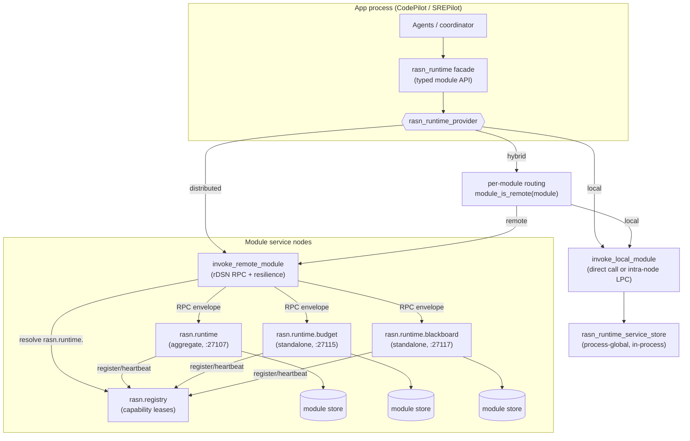
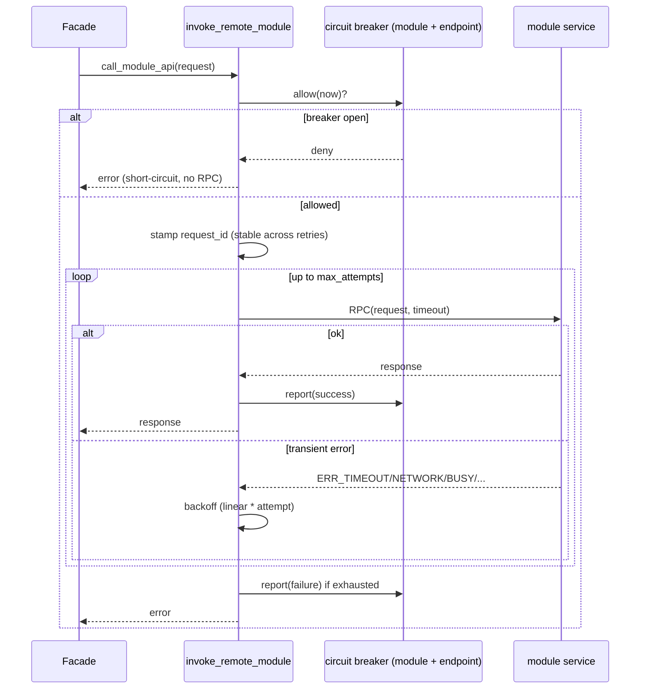

# Distributed rASN runtime

This document is the design for the rASN **runtime**: the layer that hosts
the eleven shared modules every pilot (CodePilot, SREPilot, …) depends on, and
makes them deployable either in-process or as distributed services across one or
many rDSN nodes.

It captures the architecture, the provider model, the request/response contract,
the resilience and consistency policies, and the multi-node roadmap. For the
broader rASN design see [DESIGN.md](DESIGN.md); for operator-facing configuration
and the module/port table see the "Distributed rASN runtime modules" section of
[../README.md](../README.md).

## 1. Motivation

The rASN runtime modules (agent control plane, message bus, task orchestration kernel,
determinism ledger, capability directory, resource budget, recovery supervisor,
blackboard, contract verifier, human interaction, sandbox runtime) started life
as plain C++ objects embedded in the CLI process. That is fine for a single-process
prototype but does not match the intended rASN architecture, where:

- apps should talk to shared services through a **runtime/provider API**, not by
  reaching into module objects, and
- modules should be **independently deployable** so a cluster can scale, isolate,
  and place them per workload.

The rASN runtime turns that module layer into an rDSN-native, provider-selected
service tier that apps consume through one stable facade.

## 2. Design principles

1. **The runtime is a pluggable provider, like an rDSN environment/aspect provider.**
   There is a `local` provider, a `distributed` provider, and a `hybrid` provider.
2. **The deployment shape is chosen by configuration, not by app code.** Switching
   providers changes where modules run; apps are untouched.
3. **Apps depend only on the facade API.** `rasn_runtime` exposes typed,
   coarse-grained operations. Apps never see LPC vs. RPC, endpoints, retries, or
   serialization.
4. **The distributed provider talks to remote module services over RPC.** Services
   deploy on one or many nodes; modules are decoupled and independently placeable;
   operators supply endpoints (shared or per module).
5. **The local provider calls modules directly in-process** (or over an intra-node
   LPC when an rDSN node is active), with no network on the path.

These five principles are the user's design; the sections below realize them and
add the contracts a real network needs (resilience, idempotency, consistency,
discovery, security).

## 3. Architecture



Layers:

- **Facade — `rasn_runtime`.** The only surface apps use. Methods such as
  `reserve_budget`, `put_blackboard`, `acquire_agent_lease`, plus health/topology
  (`ping_module`, `module_health`, `describe_module_health`, `describe_topology`).
- **Provider — `rasn_runtime_provider`.** Strategy behind the facade. Concrete
  providers: `local`, `distributed`, `hybrid`. Providers implement two protected
  primitives — `call_module_api(request)` and `write_state(...)` — plus health and
  topology hooks. The facade builds every operation on top of `call_module_api`.
- **Transport helpers.** `invoke_local_module`, `invoke_remote_module`, and
  `ping_remote_module` are shared free functions so all three providers apply the
  same resilience/idempotency policy; there is exactly one copy of the RPC logic.
- **Service — `rasn_runtime_rpc_service`.** A serverlet that registers a
  per-module RPC handler and dispatches into the service store. Hosted by the
  aggregate `rasn.runtime` app or by a standalone `rasn.runtime.<module>` app.
- **State — `rasn_runtime_service_store`.** Owns the actual module objects. It is
  the authority for module state and is where server-side idempotency lives.

## 4. The module API contract (envelope)

Every operation, regardless of provider, is expressed as one request/response pair
so a call can travel unchanged over a direct call, an LPC, or an RPC:

```cpp
struct rasn_runtime_request {
    uint32_t    schema_version;
    std::string module;       // e.g. "resource_budget"
    std::string operation;    // e.g. "reserve", "put", "mirror_state:usage"
    std::string key;
    std::string payload;      // module-specific encoded fields
    std::string request_id;   // optional idempotency id (see §7)
    uint32_t    route_partition; // optional exact shard for fan-out reads
    std::string auth_token;   // optional RPC shared-token credential (see §9)
};

struct rasn_runtime_response {
    uint32_t    schema_version;
    bool        ok;
    std::string error;
    std::string module;
    std::string operation;
    std::string key;
    std::string payload;
};
```

Design notes:

- **Coarse-grained on purpose.** The network is a leaky abstraction: latency,
  partial failure, and reordering are real. Operations are whole module actions
  (reserve a budget, put a blackboard entry), not chatty getters/setters, so one
  app action is one round trip.
- **Serialization is append-only.** `marshall`/`unmarshall` write fields in order;
  new fields (like `request_id`, `route_partition`, and `auth_token`) are
  appended at the end so the encoding stays forward-compatible within a build.
- **Typed schemas are future work.** Today the payload is a generic encoded field
  map. The roadmap replaces it with generated per-module RPC schemas while keeping
  the same envelope shape.

## 5. Provider model

| Provider | Where modules run | Module API path | State service | Select with |
| --- | --- | --- | --- | --- |
| `local` | In-process (direct call, or intra-node LPC under a node) | LPC / direct | disabled | `rasn_runtime_provider = local` (or `embedded`) |
| `distributed` | Remote service node(s) | rDSN RPC | enabled (mirrors writes) | `rasn_runtime_provider = distributed` |
| `hybrid` | Per module: local **or** remote | LPC or RPC per module | enabled for remote-routed modules | `rasn_runtime_provider = hybrid` |

- **Selection** mirrors the rDSN provider-by-config-name pattern:
  `normalize_rasn_runtime_provider_name` maps friendly aliases
  (`embedded`/`in-process` → `local`; `rdsn`/`remote` → `distributed`;
  `mixed`/`per-module` → `hybrid`), and `create_rasn_runtime` constructs the
  matching provider. Apps are unaffected.
- **Hybrid routing** reads `[rasn.service] <module>_mode` (falling back to
  `rasn_runtime_default_mode`); `remote`/`distributed`/`rpc` route over RPC,
  everything else stays local. This lets an operator co-locate latency-sensitive
  modules with the app while pushing shared stateful modules onto their own nodes.
- **State mirroring and hydration.** The distributed provider writes each
  successful state mutation to the shared state service (`put_state`); the hybrid
  provider mirrors only modules it routes remotely, matching each module's actual
  owner. A runtime module service queries `rasn_runtime_state_prefix` on startup,
  filters records by hosted module, sorts by state sequence, and replays typed
  hydration operations before opening its RPC handlers. If hydration is enabled
  and the configured state service cannot be queried, startup fails closed instead
  of serving empty state; set `rasn_runtime_state_hydration_enabled = false` only
  for intentionally cold local experiments. This gives standalone module services
  restart recovery from the mirror. When
  `rasn_runtime_state_watermark_enabled` is true, each mirrored mutation also
  writes a per-module `watermark` record containing the committed state-record
  sequence; hydration verifies those watermarks before replay when
  `rasn_runtime_state_watermark_verify_enabled` is true. Any hosted module that
  has mirrored data records must also have a valid watermark, so a torn,
  incomplete, or pre-watermark mirror fails closed instead of silently serving
  partial state.
  Operators can run `codepilot state compact` with an optional `--prefix` and
  checkpoint path to query the mirror, verify existing watermarks, and fold the
  shared state service into a compact checkpoint/journal baseline. Locally
  routed hybrid modules are intentionally not mirrored, so flipping a module from
  `local` to `remote` is still a **cold migration** unless an operator exports/
  imports that module's prior local state.

## 6. Endpoints, placement, and topology

- **Endpoint resolution** (`resolve_rasn_runtime_endpoint`): when
  `rasn_runtime_registry_discovery_enabled` is true, the distributed path first
  queries `rasn.registry` for a live descriptor. Sharded modules first query the
  exact `rasn.runtime.<module>.shard.<n>` capability, then fall back to
  `rasn.runtime.<module>`; non-sharded modules query only the module capability.
  If discovery is empty or unavailable, it falls back to static config:
  `<module>_uri` (or shared `rasn_runtime_uri`) if set; otherwise
  `<module>_host`/`<module>_port` with shared fallbacks, default port `27107`
  (the aggregate service). So a module can point at the registry-selected live
  service, the aggregate service, a standalone role, or a URI-backed rDSN cluster
  — independently per module.
- **Shard-aware placement.** Modules whose descriptor is `sharded`
  (`agent_message_bus`, `resource_budget`, `blackboard`) can set
  `<module>_shard_count > 1`. Mutating and keyed read operations route by the
  module's natural key (`message_id`, budget `scope`, blackboard `key`) using a
  deterministic FNV-1a hash; fan-out reads such as snapshots query each distinct
  shard endpoint and merge the typed results. Static per-shard endpoint knobs are
  `<module>_shard_<n>_{uri,host,port}` with the normal per-module endpoint as the
  fallback. For registry-routed shards, a module service can set
  `<module>_hosted_shards = 0,2` (or `all`) so it publishes explicit
  `rasn.runtime.<module>.shard.<n>` capabilities. If no shard-specific descriptor
  is live, clients retain the older module-level fallback that maps sorted live
  descriptors across configured shard indexes.
- **Registry publication.** Runtime module service apps publish one lease-tracked
  descriptor per hosted module when
  `rasn_runtime_registry_registration_enabled` is true. The base descriptor
  capability is `rasn.runtime.<module>` and the endpoint is the app's rDSN primary
  address. When `<module>_hosted_shards` or `<module>_shard_index` is configured
  for a sharded module, the same descriptor also advertises
  `rasn.runtime.<module>.shard.<n>` for those partitions. A heartbeat keeps the
  lease live and stop unregisters it. Aggregate services therefore publish all
  eleven base capabilities, while standalone services publish only their module
  plus any explicitly hosted shard labels.
- **Standalone roles.** Each module has a `rasn.runtime.<module>` role and a
  standalone app; launch it with a reachable state service for hydration (for
  example `--dsn config.ini "rasn.state;resource_budget"`, or a remote
  `[rasn.service] state_uri`). The app-list is normalized to the role. This is
  what makes modules independently deployable.
- **Compatibility aliases.** App-list normalization and app registration still
  accept the earlier `rasn.common.*` roles, so existing distributed-runtime
  app-list scripts keep working while new deployments use the `rasn.runtime.*`
  names.
- **Topology reporting.** `describe_topology()` renders, per module, its routing
  (local/remote), resolved endpoint source (`registry:` or `static:`; sharded
  modules list `shardN=...#shard=N/count`), standalone role, intended consistency
  model, and statefulness — the operator's view for validating a multi-node
  layout.

### 6.1 Configuration file layout

A rASN application is a thin TUI/GUI; all agent logic and services live in the
rASN **runtime**. Configuration splits into two files, composed with rDSN's
optional `@include?` directive (resolved relative to the process working
directory). Crucially, an **app never carries runtime/service config** — the
composition runs *runtime → app*, not app → runtime:

| File | Audience | Contents |
| --- | --- | --- |
| `config.ini` | applications | **One per app** (`apps/<app>/config.ini`), thin. Only a minimal rDSN bootstrap (`[modules]` + `[core]`), the app's own `[apps.rasn.<app>]` section, and the two things an app cares about: the runtime **location** (`[rasn.runtime]`) and, optionally, the LLM serving endpoint (`[rasn.model]`). It carries **no** `[rasn.service]` endpoint map and **no** `[apps.rasn.*]` service-deployment sections. |
| `config.rasn.ini` | runtime nodes | **Single shared file** (`src/plugins/rasn/config.rasn.ini`), binplaced identically next to every app. The **complete rASN runtime**: rDSN `[modules]`/`[core]`/thread pools, the `[rasn.service]` endpoint map + `[rasn.rpc]` timeouts, every `[apps.rasn.*]` service/module app, and all agent-logic tuning (`[rasn.model]`, `[rasn.tool]`, `[rasn.overload]`, `[rasn.policy]`, `[rasn.coordination]`, …). Loaded only on a node that *hosts* the runtime. At its top it `@include?`s the co-hosted app's thin `config.ini`, so an all-in-one node runs the app beside the services in one process. |

Who loads what:

- **Default `<app>` (local, no args)** loads only its thin `config.ini`. The
  runtime modules are built in-process on built-in defaults; the app sees no
  service/deployment config at all.
- **All-in-one runtime host (`<app> --dsn`)** loads `config.rasn.ini` (the app's
  `--dsn` mode resolves the runtime file first), which `@include?`s the local
  `config.ini` to pull in `[apps.rasn.<app>]` + `[rasn.runtime]`. The service
  apps launch alongside the app in one process; the app reaches them via LPC.
- **Dedicated remote runtime node** deploys `config.rasn.ini` with no local
  `config.ini` present — the optional include is skipped and the node runs the
  service stack headless.
- **Thin client → remote runtime.** The app keeps only its `config.ini`, sets
  `[rasn.runtime] rasn_runtime_mode = distributed`, and gives the remote runtime
  address in a small `[rasn.service]` block (`rasn_runtime_host`/`_port`). It
  still never loads the runtime's service-deployment config.

Both files are binplaced next to each executable so the relative `@include?`
resolves at runtime. Each app ships its own thin `config.ini`; they all binplace
the **same** shared `config.rasn.ini`, so there is exactly one runtime config to
maintain.

## 7. Resilience and idempotency (runtime-owned)

Because the network is on the path in `distributed`/`hybrid`, the runtime — not
the apps — owns the failure contracts. All of this lives in `invoke_remote_module`
/ `ping_remote_module`, so every module and provider inherits it uniformly.



- **Timeouts & bounded retries.** Per-module RPC timeout (falls back to
  `[rasn.rpc] timeout_ms`), a bounded retry count on *transient* transport errors
  (`ERR_TIMEOUT`, `ERR_NETWORK_FAILURE`, `ERR_NETWORK_INIT_FAILED`, `ERR_BUSY`,
  `ERR_CAPACITY_EXCEEDED`, `ERR_TRY_AGAIN`), and linear backoff. Non-transient
  errors fail fast.
- **Per-endpoint circuit breaker.** A process-global `circuit_breaker_registry`
  keyed by `module + shard + resolved endpoint`. On repeated transport failures
  the breaker opens and calls short-circuit for a cooldown before a single
  half-open probe is admitted, so one dead module endpoint cannot stall every
  request or amplify load. Health pings check every configured shard, consult
  `is_open`, and skip a probing round trip while open. Reuses the same
  `circuit_breaker` engine as the model gateway and remote-agent dispatch.
- **Idempotent retries.** A retry after a *lost reply* is dangerous: the server may
  have already applied the write. So `invoke_remote_module` stamps each logical
  call with a unique `request_id` that is **stable across its own retries**. For
  mutating operations, the service store installs an in-flight placeholder keyed
  by the full request signature plus `request_id` (including any route partition)
  before applying the mutation; an identical concurrent duplicate waits for the
  first response and then returns it, while an accidental id collision on another
  key, shard, or payload is treated as a distinct request. Read-only operations
  are not retained in the dedup cache. The
  window is bounded by `rasn_runtime_dedup_capacity` and
  `rasn_runtime_dedup_ttl_ms`; duplicate waiters are additionally capped by
  `rasn_runtime_dedup_wait_timeout_ms` so a slow or failed owner cannot occupy
  RPC handler threads indefinitely. Only successful responses are cached; failed
  responses clear the placeholder and let later retries re-execute. Dedup
  activity is exposed through metrics
  (`rasn_runtime_dedup_{hit,miss,wait,evicted,expired}_total`). This suppresses
  lost-reply double-apply within one service process; it is not cross-process
  exactly-once.
- **Strict vs. degrade.** Facade calls return explicit errors to their caller;
  when `rasn_runtime_strict` is true, a successful in-memory mutation whose
  state mirror or watermark write fails is surfaced as a failed facade call
  instead of being reported as success with only a warning. In non-strict mode,
  mirror failures remain degradation warnings.

### 7.1 Core-service client resilience

The failure contracts above cover the 11 runtime **modules** reached through
`invoke_remote_module`. rASN also depends on a handful of older, always-on **core
services** reached over ordinary rDSN RPC — `rasn.state`, `rasn.workflow`,
`rasn.observability`, and the `rasn.registry` discovery lookup that gates request
routing. Historically each of those made a single one-shot `::dsn::rpc::call`, so a
transient blip on any of those hops surfaced as a hard failure with no breaker and
no retry, even though the module path was fully hardened. That asymmetry is closed
by the shared `resilient_rpc_call` helper in `rpc_resilience.h`, which gives every
cross-node core dependency the *same* policy, reusing the shared `circuit_breaker`
engine rather than introducing another bespoke mechanism:

- **Per-endpoint circuit breaker.** A process-global `circuit_breaker_registry`
  (`global_rasn_core_breakers()`) keyed by service + resolved endpoint. While an
  endpoint is unhealthy, calls short-circuit with `ERR_BUSY` without touching the
  dependency, exactly as the module path does.
- **Idempotency-aware retries.** Errors that prove the request never applied
  (`ERR_NETWORK_FAILURE`, `ERR_NETWORK_INIT_FAILED`, `ERR_BUSY`,
  `ERR_CAPACITY_EXCEEDED`, `ERR_TRY_AGAIN`) are retried for *any* operation. The
  ambiguous `ERR_TIMEOUT` — where the server may already have applied the write —
  is retried **only** for operations the caller declares idempotent. Reads and
  key-overwrite writes are idempotent; compare-and-swap (`put_conditional`) and
  starting a workflow run are not, so a lost reply on those fails fast instead of
  risking a double-apply. Linear backoff (`backoff_ms * attempt`) separates
  retries; total attempts are `rasn_core_rpc_retries + 1`.
- **Config.** `[rasn.service] rasn_core_rpc_retries`, `rasn_core_rpc_backoff_ms`,
  `rasn_core_rpc_breaker_enabled`, `rasn_core_rpc_breaker_failures`, and
  `rasn_core_rpc_breaker_open_ms`. The RPC timeout reuses `[rasn.rpc] timeout_ms`.
  The in-process (non-distributed) path is unchanged: resilience wraps only the
  RPC-client branch, so single-process runs pay nothing.

Like module dedup, this is per-service-process resilience; it suppresses transient
transport failures and fast-fails dead endpoints, but it is not cross-process
exactly-once and does not replace the replicated backends discussed in §8 and §13.

## 8. Consistency models

Stateful modules are not all the same, so each declares an **intended** consistency
model (`rasn_runtime_module_descriptors()`). These describe the target rDSN-native
replication strategy; today's in-memory store realizes each as a single-writer
singleton per service.

| Model | Meaning | Modules |
| --- | --- | --- |
| `singleton` | One authoritative instance; small control-surface state. | `human_interaction`, `sandbox_runtime` |
| `sharded` | Partition state by a natural key; scale horizontally. | `agent_message_bus` (topic), `resource_budget` (scope), `blackboard` (key) |
| `replicated` | Ownership/ledger state that needs consensus for correctness/HA. | `agent_control_plane`, `task_orchestration_kernel`, `determinism_ledger`, `capability_directory`, `recovery_supervisor`, `contract_verifier` |

The current prototype implements deterministic partition routing for the sharded
modules above, so a configured shard count can spread different keys across
independent module service stores. The intent is still to back
`replicated`/`sharded` modules with rDSN's native replication/partitioning rather
than reinventing consensus in rASN.

> **Until then — one active writer per shard.** Because each store is a
> single-writer in-memory singleton, running multiple active instances for the
> same shard does **not** replicate state; it produces split-brain state.
> `describe_topology()` reports each module as
> `consistency=<intended>(intended) actual=single_writer_in_memory` to make this
> explicit. Use `<module>_shard_count` and per-shard endpoints only to partition
> sharded modules by key; replicated modules still need exactly one active writer
> until a real replicated backend fronts them. That single-writer constraint is now
> *enforceable* rather than operator-discipline-only: the coordination module
> (§13.7) elects exactly one owner per shard via rDSN `distributed_lock_service`, so
> a module can acquire ownership before serving writes even before quorum
> replication lands.

## 9. Discovery and security

- **Discovery over static endpoints.** Static `host`/`port`/`uri` config remains
  the baseline and fallback. The distributed/hybrid remote path now resolves
  module services through the existing `rasn.registry` capability API first, so a
  client can find a live service instance by module capability instead of carrying
  every module's endpoint in its own config. Discovery uses registry health/lease
  filtering and the same bounded registry RPC timeout as dynamic agent
  registration.
- **Failover boundary.** Registry discovery selects a live descriptor at call time,
  and the circuit breaker is keyed by the resulting endpoint. A module can
  therefore fail over to a different registered endpoint after the registry stops
  returning the unhealthy descriptor, while static config remains the deterministic
  fallback when registry is unavailable.
- **Cross-node module auth.** Distributed runtime module RPC can require a shared
  service token with `[rasn.service] rasn_runtime_auth_enabled = true` and
  a deployment-supplied `rasn_runtime_auth_token`. Remote providers stamp the token onto the
  envelope before an RPC; `rasn_runtime_rpc_service` verifies it before dispatch
  and clears it before module handlers see the request. Invalid or missing tokens
  are rejected as normal runtime responses and counted by
  `rasn_runtime_auth_rejected_total`. Local/direct and intra-node LPC paths bypass
  this gate, so trusted single-process experiments remain unchanged. The token is
  a prototype shared-secret control, not transport encryption; deploy it only on
  trusted networks or under an encrypted/authenticated transport.

## 10. Deployment examples

Aggregate (all modules behind one service):

```ini
[rasn.runtime]
rasn_runtime_provider = distributed
[rasn.service]
rasn_runtime_registry_discovery_enabled = false
rasn_runtime_host = modules-host
rasn_runtime_port = 27107
```

Per-module placement (standalone services on their own nodes):

```ini
[rasn.runtime]
rasn_runtime_provider = distributed
[rasn.service]
rasn_runtime_registry_discovery_enabled = false
resource_budget_host = budget-node
resource_budget_port = 27115
blackboard_uri      = dsn://meta-server:34601/rasn-blackboard
```

Registry-backed placement (services register capabilities, clients discover them):

```ini
[rasn.runtime]
rasn_runtime_provider = distributed
[rasn.service]
rasn_runtime_registry_discovery_enabled = true
rasn_runtime_registry_registration_enabled = true
registry_host = registry-node
registry_port = 27100
```

Service-to-service auth for runtime RPC:

```ini
[rasn.runtime]
rasn_runtime_provider = distributed
[rasn.service]
rasn_runtime_auth_enabled = true
; supply rasn_runtime_auth_token from a deployment-specific config overlay
rasn_runtime_auth_token =
```

Key-sharded placement (static endpoints, deterministic by key):

```ini
[rasn.runtime]
rasn_runtime_provider = distributed
[rasn.service]
rasn_runtime_registry_discovery_enabled = false
blackboard_shard_count = 2
blackboard_shard_0_host = blackboard-a
blackboard_shard_0_port = 27117
blackboard_shard_1_host = blackboard-b
blackboard_shard_1_port = 27127
resource_budget_shard_count = 2
resource_budget_shard_0_uri = dsn://meta-server:34601/rasn-budget-a
resource_budget_shard_1_uri = dsn://meta-server:34601/rasn-budget-b
```

Registry-discovered shard ownership on a standalone module service:

```ini
[rasn.service]
rasn_runtime_registry_registration_enabled = true
blackboard_shard_count = 2
blackboard_hosted_shards = 0
```

State mirror durability watermarks:

```ini
[rasn.service]
rasn_runtime_state_hydration_enabled = true
rasn_runtime_state_watermark_enabled = true
rasn_runtime_state_watermark_verify_enabled = true
```

Compact the verified mirror into the state checkpoint/journal baseline:

```bat
codepilot.exe state compact --prefix rasn/runtime
codepilot.exe state compact --prefix rasn/runtime rasn/state/runtime-mirror.chkpt
```

Hybrid (agents call most modules in-process; shared state on dedicated nodes):

```ini
[rasn.runtime]
rasn_runtime_provider = hybrid
[rasn.service]
rasn_runtime_default_mode = local
blackboard_mode      = remote
blackboard_host      = blackboard-node
resource_budget_mode = remote
resource_budget_host = budget-node
```

Launch one standalone module service:

```bat
codepilot.exe --dsn config.ini "rasn.state;resource_budget"
```

## 11. Roadmap

- **Distributed coordination — DELIVERED (§13.7):** a coordination module reusing
  rDSN `distributed_lock_service` (leader election / single-writer ownership) and
  `meta_state_service` (cluster-shared state), with `inproc`/`simple`/`zookeeper`
  backends. Remaining: wire runtime modules to acquire ownership before serving
  writes, and move breaker/dedup/quota counters onto the shared store (finding 1.5).
- Multi-process integration tests for the distributed/hybrid RPC paths.
- Generated typed RPC schemas per module (replace the generic envelope payload).
- State-mirror compaction/watermarks promotion is partially complete: watermarks
  are written and verified, and operators can run a watermark-verified checkpoint
  compaction command; explicit watermark pruning and local-to-remote migration
  tooling remain.
- Real replicated storage and shard durability via rDSN-native replication/partitioning.
- Deployment examples/tests for multi-node and URI-backed module clusters.
- End-to-end trace propagation across core/module RPC envelopes — **DONE** (§13.4).

See §13 for the full production-readiness audit that drives this roadmap, including
which gaps are resolved in code, mitigated client-side, or tracked as framework work.

## 12. Code map

| Concern | Location |
| --- | --- |
| Facade + provider base, envelopes, descriptors | `runtime_provider.h` |
| Providers (`local`/`distributed`/`hybrid`), transport helpers, breaker, dedup, service store, apps | `runtime_provider.cpp` |
| Core-service client RPC resilience (breaker + idempotency-aware retries) | `rpc_resilience.h` / `rpc_resilience.cpp` |
| Distributed coordination facade (ownership election + cluster-shared state) reusing rDSN `distributed_lock_service` / `meta_state_service` | `coordination_service.h` / `coordination_service.cpp` |
| RPC/LPC task codes | `rasn.code.definition.h` |
| Reusable circuit breaker engine | `circuit_breaker.h` / `circuit_breaker.cpp` |
| Provider/endpoint/resilience config | `[rasn.runtime]` in each app's `config.ini`; `[rasn.service]`/`[rasn.rpc]` in the shared `config.rasn.ini` |
| Coordination config | `[rasn.coordination]` in the shared `config.rasn.ini` |
| Config file layout (app / runtime split via optional `@include?`) | `config.ini` + `config.rasn.ini` (see §6.1) |
| Tests | `tests/rasn_unit_tests.cpp`, `tests/rasn_coordination_test.cpp` |

## 13. Production-readiness audit — findings, remediation, and status

This section merges a focused production-readiness audit of `src/plugins/rasn`
against the "fully distributed, reuse rDSN, no missing critical modules" bar this
document sets. Findings are grouped by three lenses and severity-ranked. Each
carries an explicit **status**:

- **RESOLVED (code)** — fixed in this codebase and behaviorally validated.
- **MITIGATED (code)** — materially improved client-side; full fix needs a
  framework-backed component below.
- **DOCUMENTED (roadmap)** — the correct rDSN-native design is identified and
  captured here; implementation is framework work that depends on rDSN subsystems
  (replication, meta-server/ZooKeeper, Thrift codegen) that a rASN-only change
  cannot honestly land or verify in isolation.

The guiding principle is **reuse rDSN, don't reinvent it**: wherever rASN grew a
bespoke mechanism, the audit names the rDSN facility that should back it.

### 13.1 Lens 1 — Is rASN *fully* distributed?

| # | Sev | Finding | Status |
| --- | --- | --- | --- |
| 1.1 | P0 | **Stateful modules are single-writer in-memory, not quorum-replicated.** The 11 runtime modules and the state service realize `replicated`/`sharded` intent (§8) as single-writer singletons mirrored to `rasn.state`; running >1 active writer per shard is split-brain, not HA. | **MITIGATED (code)** — the new coordination module (§13.7) reuses rDSN `distributed_lock_service` to elect **exactly one** active owner per shard (single-writer enforcement / leader election). Quorum **replication** of the state itself still DOCUMENTED → §13.5 (`replicated_service_app_type_1`) |
| 1.2 | P0 | **Core services had no RPC resilience.** `rasn.state` / `rasn.workflow` / `rasn.observability` clients made one-shot RPCs — no breaker, no retry — while the module path was fully hardened. A single transient blip failed the call. | **RESOLVED (code)** — §7.1, `rpc_resilience.h`, wrapped in `agent_services.cpp` |
| 1.3 | P0 | **Registry discovery is an in-memory SPOF on the request path.** Routing resolves live endpoints through a single `rasn.registry`; if that lookup blips the request fails, and the registry itself is not replicated. | **MITIGATED (code)** — the routing-critical discovery query in `coordinator_service.cpp` now goes through `resilient_rpc_call` (breaker + idempotent retry). Registry **HA** still DOCUMENTED → §13.5 (meta-server / ZooKeeper) |
| 1.4 | P1 | **RPC envelopes carry no end-to-end trace id.** `agent_request`/`response` carry `trace_id`, but the runtime-module envelope (`make_module_request`) didn't propagate it, so a call couldn't be followed across nodes in logs. | **RESOLVED (code)** — §13.4; `trace_id` added to the runtime-module envelope (EOF-safe), stamped from an ambient scope on egress, restored/echoed on ingress |
| 1.5 | P1 | **Resilience/quota/dedup state is per serving process.** Breaker, dedup, admission, and rate state live on whichever node serves the RPC; there is no shared view, so protection is per-replica, not cluster-global. | **MITIGATED (code)** — the coordination module (§13.7) reuses rDSN `meta_state_service` to provide a cluster-shared, authoritative state store (`put/get/list/delete_state`); wiring each breaker/dedup/quota counter onto it is the remaining per-module integration. |
| 1.6 | P2 | **Core service endpoints are bound at construction.** Some core clients resolve their peer once; combined with 1.3 this limits failover for non-discovery paths. | MITIGATED by 1.2/1.3 breaker keying; full dynamic rebind DOCUMENTED |

### 13.2 Lens 2 — Reinvention vs. reuse of rDSN

rASN correctly reuses `serverlet`/`clientlet` RPC, `perf_counter` metrics,
`command_manager`, `zlock`, `exp_delay` backpressure, NFS
(`dsn::file::copy_remote_files`) in the state service, and — as of the coordination
module (§13.7) — `dist::distributed_lock_service` and `dist::meta_state_service` for
ownership election and cluster-shared state. The audit found four places
where rASN grew a parallel mechanism that an existing rDSN facility should own:

| Concern | rASN today | rDSN facility to reuse | Status |
| --- | --- | --- | --- |
| State replication / HA | in-memory map + file checkpoint/journal + optional local replica copy | `replicated_service_app_type_1` (layer-2 replication SM: `checkpoint`/`learn`/`apply`) | DOCUMENTED |
| Partition routing | hand-rolled `fnv1a64(key) % shard_count` in the module bus/budget/blackboard | `dist::partition_resolver` (partition→endpoint resolution with config/meta integration) | DOCUMENTED |
| Discovery + failure detection | `rasn.registry` heartbeat/lease table (single instance) | meta-server + `failure_detector` + `ext/zookeeper` for HA membership | DOCUMENTED |
| Wire schema / IDL | generic envelope with a field-map payload + `schema_manifest` codegen | Thrift IDL + `dsn.tools` codegen (typed, versioned RPC structs) | DOCUMENTED |

The coordination module (§13.7) proves this reuse pattern is viable end-to-end: the
`rDSN.dist.service` ext plugin builds and links into rASN under a full
`--build_plugins` checkout, and its `distributed_lock_service`/`meta_state_service`
providers are consumed directly (validated on real hardware). The four migrations
above are larger in scope — each swaps a core data-plane mechanism (replication state
machine, partition resolver, HA membership, or the entire wire schema) and pulls in
the framework's Thrift/boost/ZooKeeper `ExternalProject` toolchain — so they are
documented with their exact target facility and sequenced behind the coordination
groundwork rather than stubbed.

### 13.3 Lens 3 — Missing critical modules

Toward a production agent nucleus, the audit flags these gaps (all DOCUMENTED
roadmap items, ordered by importance):

- **P0 durable/vector agent memory** — a first-class long-term memory module
  (semantic + episodic) with a durable, queryable backend, distinct from the
  short-lived blackboard/session stores.
- **P0 distributed coordination** — **DELIVERED (code, §13.7).** Leader election and
  distributed locks now reuse rDSN `distributed_lock_service`, and a cluster-shared
  state store reuses `meta_state_service`, so single-writer modules (§8) can elect
  exactly one owner cluster-wide via real rDSN primitives (meta-server/ZooKeeper
  under the ZooKeeper backend), not a rASN-local lock. Making a **global** quota/rate
  authority consume this shared store is the remaining per-module wiring.
- **P0 secrets vault** — a real secret provider behind the existing `env:`/`file:`/
  `cmd:` credential handles (see DESIGN "Credential storage").
- **P0 multi-tenancy / isolation** — per-tenant identity, quota, and data
  isolation across all modules.
- **P0 distributed scheduler / placement** — placement of module shards and agent
  work across nodes (today placement is static config + deterministic hashing).
- **P1** — centralized durable **audit log**, automatic cross-node **recovery**
  (supervisor promotes a new owner on node loss), cross-node **exactly-once/saga**
  (current dedup is per-process), and cross-node **backpressure / distributed
  cache**.

### 13.4 Trace propagation (finding 1.4) — RESOLVED

One trace id now threads through every runtime-module hop so a request can be
followed across nodes. As built:

1. **Ambient context.** `runtime_provider.cpp` holds a `thread_local` ambient
   trace id exposed via `current_rasn_runtime_trace_id()` and the RAII
   `rasn_runtime_trace_scope` (declared in `runtime_provider.h`). An operation
   origin installs a scope for the duration of the call; nested module requests
   inherit it. An empty id is a no-op, so callers install unconditionally.
2. **Stamp on egress.** `make_module_request(...)` reads the ambient trace id and
   stamps it onto the envelope. A `trace_id` field was appended to both
   `rasn_runtime_request` and `rasn_runtime_response`, unmarshalled EOF-safe
   exactly like `route_partition`/`auth_token`, so old and new peers interoperate.
3. **Restore + echo on ingress.** `rasn_runtime_rpc_service::reply_module_request`
   installs a `rasn_runtime_trace_scope` from the incoming envelope before
   dispatch, so server-side logs and any nested module calls share the id. The
   central response builder `make_rasn_runtime_response` echoes `request.trace_id`
   onto every response (success and error), so a caller can correlate the reply.
4. **Origins.** `rasn_coordinator_service::invoke` and `rasn_service_graph::invoke`
   seed the scope from the operation's `agent_request.trace_id`, falling back to
   `nucleus_runtime::trace_id()`, so module RPCs issued while coordinating share
   one end-to-end trace.

Coverage: `request_marshalling_round_trips_request_metadata` (extended),
`response_marshalling_round_trips_trace_id`,
`trace_scope_sets_and_restores_ambient_trace_id`, and
`dispatch_echoes_request_trace_id_onto_response` in `tests/rasn_unit_tests.cpp`
assert wire round-trip, legacy back-compat (empty on decode), scope
nesting/restore, and end-to-end echo. The change is purely additive to the wire
and logs — no behavior change.

The id now flows and is echoed end-to-end; surfacing it as an explicit label on
individual resilience/dedup/auth metrics and log lines is a small additive
follow-up (the ambient id is already readable via `current_rasn_runtime_trace_id()`
inside the server dispatch scope) and does not change the propagation contract.

### 13.5 rDSN-native target architecture (findings 1.1, 1.3, 1.5)

The end state keeps the app-facing `rasn_runtime` facade and the module API
contract (§4) exactly as they are, and swaps the *backing* of stateful modules:

- Back each `replicated` module and the state service with
  `replicated_service_app_type_1`, so `checkpoint`/`learn`/`apply` provide quorum
  durability and automatic learning of a new replica — replacing the single-writer
  mirror. `describe_topology()` would then report `actual=replicated` instead of
  `single_writer_in_memory`.
- Resolve `sharded` modules through `dist::partition_resolver` instead of
  `fnv1a64 % count`, so partitions map to replica groups managed by the meta-server.
- Make membership/discovery HA via the meta-server + `failure_detector` +
  `ext/zookeeper`, removing the single-registry SPOF (1.3) and giving 1.5 a shared,
  authoritative view for cluster-global quotas and coordination.

Until quorum replication lands, the operational contract in §8 stands: **exactly
one active writer per shard** — now *enforceable* through the coordination module's
`distributed_lock_service`-backed ownership election (§13.7) rather than by operator
discipline alone — with the client-side resilience from §7/§7.1 masking transient
failures but not providing replication.

### 13.6 What changed — core-service resilience + trace round

Resolved/mitigated **in code and validated** (committed as
`rasn: core-service RPC resilience + end-to-end trace propagation`):

- Core-service client RPC resilience (§7.1) — new `rpc_resilience.{h,cpp}` reusing
  the `circuit_breaker` engine; all `rasn_service_graph` state/workflow/
  observability call sites in `agent_services.cpp` and the routing-critical
  registry discovery query in `coordinator_service.cpp` now fail fast on unhealthy
  endpoints and retry transient transport errors with idempotency-aware policy
  (findings 1.2 fully, 1.3/1.6 client-side).
- Config knobs `rasn_core_rpc_*` (`[rasn.service]`) in the shared `config.rasn.ini`.
- Focused unit coverage: `rasn_rpc_resilience` in `tests/rasn_unit_tests.cpp`
  (pre-apply retry, idempotency-aware timeout policy, breaker short-circuit).
- End-to-end trace propagation across the runtime-module envelope (§13.4, finding
  1.4) — `trace_id` added to the request/response envelope (EOF-safe), an ambient
  `rasn_runtime_trace_scope` stamped on egress and restored/echoed on ingress, with
  four focused tests for wire round-trip, legacy back-compat, scope nesting, and
  dispatch echo.

Everything else above is either landed in the coordination round (§13.7) or
DOCUMENTED with its rDSN-native target because it depends on framework subsystems
(replication SM, partition resolver, IDL codegen) that are larger data-plane
migrations. This section, together with §13.7, is the source of truth for the
roadmap in §11.

### 13.7 Distributed coordination module (findings 1.1 ownership, 1.5 shared state) — RESOLVED (code)

The latest refinement round lands a first-class **coordination module** that reuses
rDSN's own distributed facilities instead of reinventing them, directly closing the
ownership half of finding 1.1 and the shared-state half of finding 1.5. Validated on
real hardware (Ubuntu, `--build_plugins`): all four coordination unit tests pass,
including the two that drive the real rDSN provider, and `codepilot`/`srepilot` link
the module cleanly.

**Facade.** `coordination_service.h` defines `rasn_coordination_service`, a small
provider-agnostic interface with two concerns:

- *Ownership / leader election* — `acquire_ownership(resource, owner_id[, timeout])`,
  `release_ownership`, `query_owner`. Exactly one caller holds a resource at a time;
  re-acquire by the same owner is idempotent; a lease is handed off after release.
- *Cluster-shared state* — `put_state` / `get_state` / `delete_state` / `list_state`
  over a hierarchical, znode-style key space rooted at a configured namespace.

**Three backends, selected by `[rasn.coordination] provider`:**

| Backend | Reuses | Use |
| --- | --- | --- |
| `inproc` | in-process maps (no external dep) | default single-node fallback; always compiled |
| `simple` | rDSN `distributed_lock_service_simple` + `meta_state_service_simple` | unit tests / single-writer dev; **coordinates only within one in-process facade instance** (see note); durable simple meta-state log |
| `zookeeper` | rDSN `distributed_lock_service_zookeeper` + `meta_state_service_zookeeper` | production HA over a ZooKeeper ensemble (`[zookeeper] hosts_list`); the only backend that coordinates across independent processes/apps |

> **`simple` is single-instance.** The rDSN simple providers keep their lock table
> and state tree in per-object members, so each `dist_coordination_service` that
> constructs them coordinates only with itself. Two facade instances in one process
> — or two processes — share nothing. Use `simple` where exactly one facade instance
> is the coordinator (unit tests, single-writer dev); use `zookeeper` for real
> cross-process / multi-app coordination, whether the participants are on one box or
> many.

The `simple`/`zookeeper` backends come from the `rDSN.dist.service` ext plugin
(`src/plugins_ext/`). The facade wraps their async, `error_code`-returning task API
behind blocking helpers. Those helpers `wait()` for completion callbacks delivered on
**`THREAD_POOL_META_SERVER`** — the pool the reused rDSN dist providers themselves
depend on: `distributed_lock_service_simple`/`_zookeeper` enqueue their own internal
work there (notably the `LPC_DIST_LOCK_SVC_RANDOM_EXPIRE` lease timer), so any app
running the `simple`/`zookeeper` backend must declare that pool regardless of where
callbacks land. It is distinct from `THREAD_POOL_DEFAULT` / `THREAD_POOL_RASN_WORKFLOW`
(which run rASN request handlers), so a caller blocked in `wait()` can never starve
the worker that runs its own callback.

Because the shipped configs default to `provider = inproc`, they deliberately do
**not** declare `THREAD_POOL_META_SERVER`. That pool is registered by the
`rDSN.dist.service` providers, which the default `[modules]` list does not load, so
declaring it (in a `pools` list or a `[threadpool.*]` section) under the default
config fails config parsing with `invalid enum configuration ... THREAD_POOL_META_SERVER`
at startup. To run a distributed backend: (1) build with `--build_plugins` so the
providers register the pool, (2) set `provider = simple|zookeeper`, (3) add
`THREAD_POOL_META_SERVER` to each rASN app's `pools` list, and (4) uncomment the
`[threadpool.THREAD_POOL_META_SERVER]` section that both configs ship (commented) for
exactly this purpose. The helpers create parent znodes on demand and track held lease
tasks.

**Correctness hardening (as-built).** Beyond the happy path, the facade fails closed
and stays retry-safe under races: (a) a lock acquire that *times out* re-checks the
grant/cancel outcome and, if it actually won the race (`cancel_pending_lock` reports
`ERR_OBJECT_NOT_FOUND` with our own `owner_id`, or the grant callback already stored
`ERR_OK`), records the hold and returns `ERR_OK` instead of leaking a granted-but-
abandoned lock; (b) `put_state` treats a lost `node_exist`→`create_node` race
(`ERR_NODE_ALREADY_EXIST`) as last-writer-wins by falling back to `set_data`, so
concurrent first-writers all succeed; (c) namespace/parent-znode creation tolerates
only `ERR_NODE_ALREADY_EXIST` and surfaces every other error — `start()` aborts if the
state namespace cannot be materialized rather than limping on against a missing root.

**Build wiring (reuse, not reinvent).** `src/CMakeLists.txt` now configures
`plugins_ext` before `plugins` so rASN can see the dist targets. The rASN library,
`codepilot`, `srepilot`, and `rasn.unit_tests` gate the dist include paths, link the
`dsn.dist.service.*` closure, and define `RASN_HAS_DIST_COORDINATION=1` **only when**
`TARGET dsn.dist.service.meta_server_lib` exists (i.e. a `--build_plugins` build).
A plain build without the ext plugin still compiles rASN with just the `inproc`
fallback, so nothing regresses for lightweight checkouts.

**Config.** `[rasn.coordination]` in the shared `config.rasn.ini`:
`provider` (`inproc`|`simple`|`zookeeper`), `lock_namespace`, `state_namespace`,
`acquire_timeout_ms`, and `state_work_dir` (durable-log directory for the `simple`
backend; ignored by the others).

**Tests.** `tests/rasn_coordination_test.cpp` asserts the ownership contract
(acquire / idempotent re-acquire / mutual exclusion / hand-off / query) and the
shared-state contract (absent-get / put / overwrite / list / delete / idempotent
delete) against the facade. The `inproc` path and config defaults always run; the
`simple`-provider cases run under `RASN_HAS_DIST_COORDINATION` and exercise the real
rDSN lock + meta-state providers, including a concurrent-`put_state` case that races
eight writers on one fresh key and asserts they all succeed (last-writer-wins).

**What remains.** The module delivers the *facility*; consuming it inside the runtime
modules is the follow-up: (a) have each `replicated`/`sharded` module acquire
ownership before serving writes (turns §8's operator-discipline single-writer into an
*enforced* one), and (b) move breaker/dedup/admission/rate counters onto the shared
state store for cluster-global protection (finding 1.5 wiring). Quorum **replication**
of the state itself remains the §13.5 `replicated_service_app_type_1` item.
