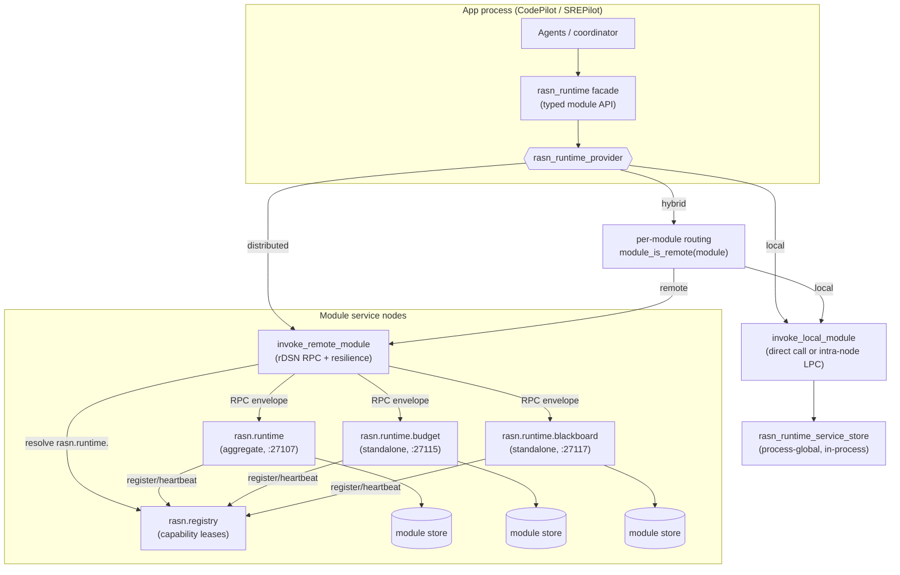
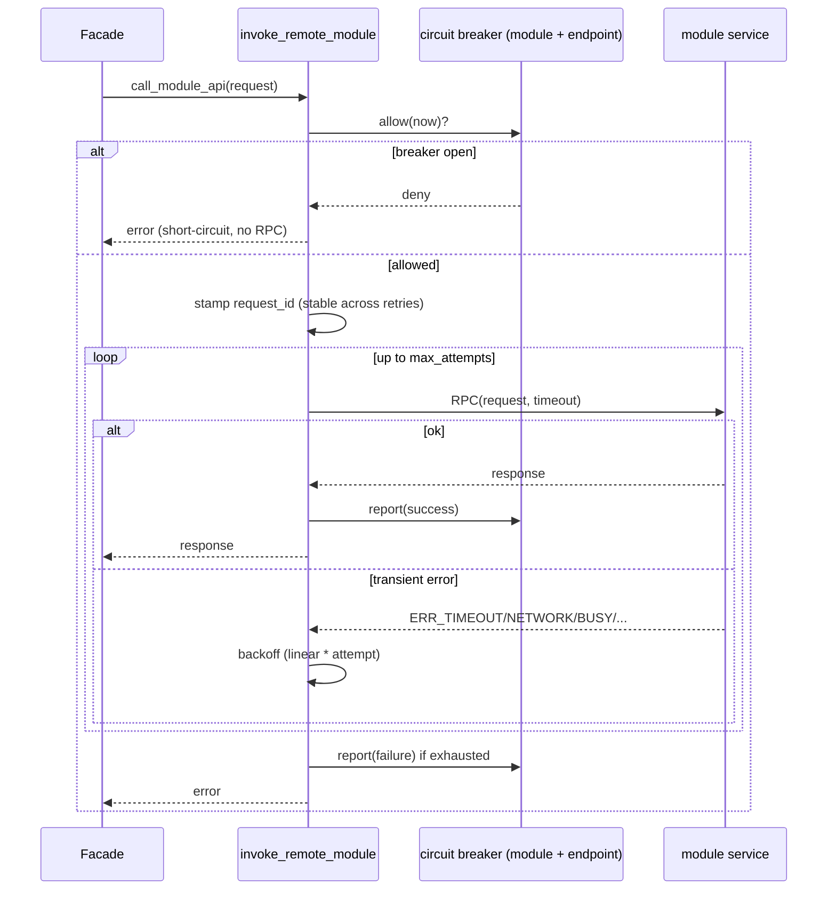

# Distributed rASN runtime

This document is the design for the rASN **runtime**: the layer that hosts
the eleven shared modules every pilot (CodePilot, SREPilot, …) depends on, and
makes them deployable either in-process or as distributed services across one or
many rDSN nodes.

It captures the architecture, the provider model, the request/response contract,
the resilience and consistency policies, and the multi-node roadmap. For the
broader rASN design see [DESIGN.md](DESIGN.md); for operator-facing configuration
and the module/port table see the "Distributed rASN runtime modules" section of
[../README.md](../README.md).

## 1. Motivation

The rASN runtime modules (agent control plane, message bus, task orchestration kernel,
determinism ledger, capability directory, resource budget, recovery supervisor,
blackboard, contract verifier, human interaction, sandbox runtime) started life
as plain C++ objects embedded in the CLI process. That is fine for a single-process
prototype but does not match the intended rASN architecture, where:

- apps should talk to shared services through a **runtime/provider API**, not by
  reaching into module objects, and
- modules should be **independently deployable** so a cluster can scale, isolate,
  and place them per workload.

The rASN runtime turns that module layer into an rDSN-native, provider-selected
service tier that apps consume through one stable facade.

## 2. Design principles

1. **The runtime is a pluggable provider, like an rDSN environment/aspect provider.**
   There is a `local` provider, a `distributed` provider, and a `hybrid` provider.
2. **The deployment shape is chosen by configuration, not by app code.** Switching
   providers changes where modules run; apps are untouched.
3. **Apps depend only on the facade API.** `rasn_runtime` exposes typed,
   coarse-grained operations. Apps never see LPC vs. RPC, endpoints, retries, or
   serialization.
4. **The distributed provider talks to remote module services over RPC.** Services
   deploy on one or many nodes; modules are decoupled and independently placeable;
   operators supply endpoints (shared or per module).
5. **The local provider calls modules directly in-process** (or over an intra-node
   LPC when an rDSN node is active), with no network on the path.

These five principles are the user's design; the sections below realize them and
add the contracts a real network needs (resilience, idempotency, consistency,
discovery, security).

## 3. Architecture



Layers:

- **Facade — `rasn_runtime`.** The only surface apps use. Methods such as
  `reserve_budget`, `put_blackboard`, `acquire_agent_lease`, plus health/topology
  (`ping_module`, `module_health`, `describe_module_health`, `describe_topology`).
- **Provider — `rasn_runtime_provider`.** Strategy behind the facade. Concrete
  providers: `local`, `distributed`, `hybrid`. Providers implement two protected
  primitives — `call_module_api(request)` and `write_state(...)` — plus health and
  topology hooks. The facade builds every operation on top of `call_module_api`.
- **Transport helpers.** `invoke_local_module`, `invoke_remote_module`, and
  `ping_remote_module` are shared free functions so all three providers apply the
  same resilience/idempotency policy; there is exactly one copy of the RPC logic.
- **Service — `rasn_runtime_rpc_service`.** A serverlet that registers a
  per-module RPC handler and dispatches into the service store. Hosted by the
  aggregate `rasn.runtime` app or by a standalone `rasn.runtime.<module>` app.
- **State — `rasn_runtime_service_store`.** Owns the actual module objects. It is
  the authority for module state and is where server-side idempotency lives.

## 4. The module API contract (envelope)

Every operation, regardless of provider, is expressed as one request/response pair
so a call can travel unchanged over a direct call, an LPC, or an RPC:

```cpp
struct rasn_runtime_request {
    uint32_t    schema_version;
    std::string module;       // e.g. "resource_budget"
    std::string operation;    // e.g. "reserve", "put", "mirror_state:usage"
    std::string key;
    std::string payload;      // module-specific encoded fields
    std::string request_id;   // optional idempotency id (see §7)
    uint32_t    route_partition; // optional exact shard for fan-out reads
    std::string auth_token;   // optional RPC shared-token credential (see §9)
};

struct rasn_runtime_response {
    uint32_t    schema_version;
    bool        ok;
    std::string error;
    std::string module;
    std::string operation;
    std::string key;
    std::string payload;
};
```

Design notes:

- **Coarse-grained on purpose.** The network is a leaky abstraction: latency,
  partial failure, and reordering are real. Operations are whole module actions
  (reserve a budget, put a blackboard entry), not chatty getters/setters, so one
  app action is one round trip.
- **Serialization is append-only.** `marshall`/`unmarshall` write fields in order;
  new fields (like `request_id`, `route_partition`, and `auth_token`) are
  appended at the end so the encoding stays forward-compatible within a build.
- **Typed schemas are future work.** Today the payload is a generic encoded field
  map. The roadmap replaces it with generated per-module RPC schemas while keeping
  the same envelope shape.

## 5. Provider model

| Provider | Where modules run | Module API path | State service | Select with |
| --- | --- | --- | --- | --- |
| `local` | In-process (direct call, or intra-node LPC under a node) | LPC / direct | disabled | `rasn_runtime_provider = local` (or `embedded`) |
| `distributed` | Remote service node(s) | rDSN RPC | enabled (mirrors writes) | `rasn_runtime_provider = distributed` |
| `hybrid` | Per module: local **or** remote | LPC or RPC per module | enabled for remote-routed modules | `rasn_runtime_provider = hybrid` |

- **Selection** mirrors the rDSN provider-by-config-name pattern:
  `normalize_rasn_runtime_provider_name` maps friendly aliases
  (`embedded`/`in-process` → `local`; `rdsn`/`remote` → `distributed`;
  `mixed`/`per-module` → `hybrid`), and `create_rasn_runtime` constructs the
  matching provider. Apps are unaffected.
- **Hybrid routing** reads `[rasn.service] <module>_mode` (falling back to
  `rasn_runtime_default_mode`); `remote`/`distributed`/`rpc` route over RPC,
  everything else stays local. This lets an operator co-locate latency-sensitive
  modules with the app while pushing shared stateful modules onto their own nodes.
- **State mirroring and hydration.** The distributed provider writes each
  successful state mutation to the shared state service (`put_state`); the hybrid
  provider mirrors only modules it routes remotely, matching each module's actual
  owner. A runtime module service queries `rasn_runtime_state_prefix` on startup,
  filters records by hosted module, sorts by state sequence, and replays typed
  hydration operations before opening its RPC handlers. If hydration is enabled
  and the configured state service cannot be queried, startup fails closed instead
  of serving empty state; set `rasn_runtime_state_hydration_enabled = false` only
  for intentionally cold local experiments. This gives standalone module services
  restart recovery from the mirror. When
  `rasn_runtime_state_watermark_enabled` is true, each mirrored mutation also
  writes a per-module `watermark` record containing the committed state-record
  sequence; hydration verifies those watermarks before replay when
  `rasn_runtime_state_watermark_verify_enabled` is true. A torn or incomplete
  mirror therefore fails closed instead of silently serving partial state.
  Operators can run `codepilot state compact` with an optional `--prefix` and
  checkpoint path to query the mirror, verify existing watermarks, and fold the
  shared state service into a compact checkpoint/journal baseline. Locally
  routed hybrid modules are intentionally not mirrored, so flipping a module from
  `local` to `remote` is still a **cold migration** unless an operator exports/
  imports that module's prior local state.

## 6. Endpoints, placement, and topology

- **Endpoint resolution** (`resolve_rasn_runtime_endpoint`): when
  `rasn_runtime_registry_discovery_enabled` is true, the distributed path first
  queries `rasn.registry` for a live descriptor. Sharded modules first query the
  exact `rasn.runtime.<module>.shard.<n>` capability, then fall back to
  `rasn.runtime.<module>`; non-sharded modules query only the module capability.
  If discovery is empty or unavailable, it falls back to static config:
  `<module>_uri` (or shared `rasn_runtime_uri`) if set; otherwise
  `<module>_host`/`<module>_port` with shared fallbacks, default port `27107`
  (the aggregate service). So a module can point at the registry-selected live
  service, the aggregate service, a standalone role, or a URI-backed rDSN cluster
  — independently per module.
- **Shard-aware placement.** Modules whose descriptor is `sharded`
  (`agent_message_bus`, `resource_budget`, `blackboard`) can set
  `<module>_shard_count > 1`. Mutating and keyed read operations route by the
  module's natural key (`message_id`, budget `scope`, blackboard `key`) using a
  deterministic FNV-1a hash; fan-out reads such as snapshots query each distinct
  shard endpoint and merge the typed results. Static per-shard endpoint knobs are
  `<module>_shard_<n>_{uri,host,port}` with the normal per-module endpoint as the
  fallback. For registry-routed shards, a module service can set
  `<module>_hosted_shards = 0,2` (or `all`) so it publishes explicit
  `rasn.runtime.<module>.shard.<n>` capabilities. If no shard-specific descriptor
  is live, clients retain the older module-level fallback that maps sorted live
  descriptors across configured shard indexes.
- **Registry publication.** Runtime module service apps publish one lease-tracked
  descriptor per hosted module when
  `rasn_runtime_registry_registration_enabled` is true. The base descriptor
  capability is `rasn.runtime.<module>` and the endpoint is the app's rDSN primary
  address. When `<module>_hosted_shards` or `<module>_shard_index` is configured
  for a sharded module, the same descriptor also advertises
  `rasn.runtime.<module>.shard.<n>` for those partitions. A heartbeat keeps the
  lease live and stop unregisters it. Aggregate services therefore publish all
  eleven base capabilities, while standalone services publish only their module
  plus any explicitly hosted shard labels.
- **Standalone roles.** Each module has a `rasn.runtime.<module>` role and a
  standalone app; launch it with a reachable state service for hydration (for
  example `--dsn config.ini "rasn.state;resource_budget"`, or a remote
  `[rasn.service] state_uri`). The app-list is normalized to the role. This is
  what makes modules independently deployable.
- **Compatibility aliases.** App-list normalization and app registration still
  accept the earlier `rasn.common.*` roles, so existing distributed-runtime
  app-list scripts keep working while new deployments use the `rasn.runtime.*`
  names.
- **Topology reporting.** `describe_topology()` renders, per module, its routing
  (local/remote), resolved endpoint source (`registry:` or `static:`; sharded
  modules list `shardN=...#shard=N/count`), standalone role, intended consistency
  model, and statefulness — the operator's view for validating a multi-node
  layout.

## 7. Resilience and idempotency (runtime-owned)

Because the network is on the path in `distributed`/`hybrid`, the runtime — not
the apps — owns the failure contracts. All of this lives in `invoke_remote_module`
/ `ping_remote_module`, so every module and provider inherits it uniformly.



- **Timeouts & bounded retries.** Per-module RPC timeout (falls back to
  `[rasn.rpc] timeout_ms`), a bounded retry count on *transient* transport errors
  (`ERR_TIMEOUT`, `ERR_NETWORK_FAILURE`, `ERR_NETWORK_INIT_FAILED`, `ERR_BUSY`,
  `ERR_CAPACITY_EXCEEDED`, `ERR_TRY_AGAIN`), and linear backoff. Non-transient
  errors fail fast.
- **Per-endpoint circuit breaker.** A process-global `circuit_breaker_registry`
  keyed by `module + shard + resolved endpoint`. On repeated transport failures
  the breaker opens and calls short-circuit for a cooldown before a single
  half-open probe is admitted, so one dead module endpoint cannot stall every
  request or amplify load. Health pings check every configured shard, consult
  `is_open`, and skip a probing round trip while open. Reuses the same
  `circuit_breaker` engine as the model gateway and remote-agent dispatch.
- **Idempotent retries.** A retry after a *lost reply* is dangerous: the server may
  have already applied the write. So `invoke_remote_module` stamps each logical
  call with a unique `request_id` that is **stable across its own retries**. For
  mutating operations, the service store installs an in-flight placeholder keyed
  by the full request signature plus `request_id` (including any route partition)
  before applying the mutation; an identical concurrent duplicate waits for the
  first response and then returns it, while an accidental id collision on another
  key, shard, or payload is treated as a distinct request. Read-only operations
  are not retained in the dedup cache. The
  window is bounded by `rasn_runtime_dedup_capacity` and
  `rasn_runtime_dedup_ttl_ms`, and exposed through metrics
  (`rasn_runtime_dedup_{hit,miss,wait,evicted,expired}_total`). This suppresses
  lost-reply double-apply within one service process; it is not cross-process
  exactly-once.
- **Strict vs. degrade.** Facade calls return explicit errors to their caller; for
  best-effort mirror writes, `rasn_runtime_strict` labels failures as strict
  provider failures instead of ordinary distributed-runtime degradation.

## 8. Consistency models

Stateful modules are not all the same, so each declares an **intended** consistency
model (`rasn_runtime_module_descriptors()`). These describe the target rDSN-native
replication strategy; today's in-memory store realizes each as a single-writer
singleton per service.

| Model | Meaning | Modules |
| --- | --- | --- |
| `singleton` | One authoritative instance; small control-surface state. | `human_interaction`, `sandbox_runtime` |
| `sharded` | Partition state by a natural key; scale horizontally. | `agent_message_bus` (topic), `resource_budget` (scope), `blackboard` (key) |
| `replicated` | Ownership/ledger state that needs consensus for correctness/HA. | `agent_control_plane`, `task_orchestration_kernel`, `determinism_ledger`, `capability_directory`, `recovery_supervisor`, `contract_verifier` |

The current prototype implements deterministic partition routing for the sharded
modules above, so a configured shard count can spread different keys across
independent module service stores. The intent is still to back
`replicated`/`sharded` modules with rDSN's native replication/partitioning rather
than reinventing consensus in rASN.

> **Until then — one active writer per shard.** Because each store is a
> single-writer in-memory singleton, running multiple active instances for the
> same shard does **not** replicate state; it produces split-brain state.
> `describe_topology()` reports each module as
> `consistency=<intended>(intended) actual=single_writer_in_memory` to make this
> explicit. Use `<module>_shard_count` and per-shard endpoints only to partition
> sharded modules by key; replicated modules still need exactly one active writer
> until a real replicated backend fronts them.

## 9. Discovery and security

- **Discovery over static endpoints.** Static `host`/`port`/`uri` config remains
  the baseline and fallback. The distributed/hybrid remote path now resolves
  module services through the existing `rasn.registry` capability API first, so a
  client can find a live service instance by module capability instead of carrying
  every module's endpoint in its own config. Discovery uses registry health/lease
  filtering and the same bounded registry RPC timeout as dynamic agent
  registration.
- **Failover boundary.** Registry discovery selects a live descriptor at call time,
  and the circuit breaker is keyed by the resulting endpoint. A module can
  therefore fail over to a different registered endpoint after the registry stops
  returning the unhealthy descriptor, while static config remains the deterministic
  fallback when registry is unavailable.
- **Cross-node module auth.** Distributed runtime module RPC can require a shared
  service token with `[rasn.service] rasn_runtime_auth_enabled = true` and
  a deployment-supplied `rasn_runtime_auth_token`. Remote providers stamp the token onto the
  envelope before an RPC; `rasn_runtime_rpc_service` verifies it before dispatch
  and clears it before module handlers see the request. Invalid or missing tokens
  are rejected as normal runtime responses and counted by
  `rasn_runtime_auth_rejected_total`. Local/direct and intra-node LPC paths bypass
  this gate, so trusted single-process experiments remain unchanged. The token is
  a prototype shared-secret control, not transport encryption; deploy it only on
  trusted networks or under an encrypted/authenticated transport.

## 10. Deployment examples

Aggregate (all modules behind one service):

```ini
[rasn.runtime]
rasn_runtime_provider = distributed
[rasn.service]
rasn_runtime_registry_discovery_enabled = false
rasn_runtime_host = modules-host
rasn_runtime_port = 27107
```

Per-module placement (standalone services on their own nodes):

```ini
[rasn.runtime]
rasn_runtime_provider = distributed
[rasn.service]
rasn_runtime_registry_discovery_enabled = false
resource_budget_host = budget-node
resource_budget_port = 27115
blackboard_uri      = dsn://meta-server:34601/rasn-blackboard
```

Registry-backed placement (services register capabilities, clients discover them):

```ini
[rasn.runtime]
rasn_runtime_provider = distributed
[rasn.service]
rasn_runtime_registry_discovery_enabled = true
rasn_runtime_registry_registration_enabled = true
registry_host = registry-node
registry_port = 27100
```

Service-to-service auth for runtime RPC:

```ini
[rasn.runtime]
rasn_runtime_provider = distributed
[rasn.service]
rasn_runtime_auth_enabled = true
; supply rasn_runtime_auth_token from a deployment-specific config overlay
rasn_runtime_auth_token =
```

Key-sharded placement (static endpoints, deterministic by key):

```ini
[rasn.runtime]
rasn_runtime_provider = distributed
[rasn.service]
rasn_runtime_registry_discovery_enabled = false
blackboard_shard_count = 2
blackboard_shard_0_host = blackboard-a
blackboard_shard_0_port = 27117
blackboard_shard_1_host = blackboard-b
blackboard_shard_1_port = 27127
resource_budget_shard_count = 2
resource_budget_shard_0_uri = dsn://meta-server:34601/rasn-budget-a
resource_budget_shard_1_uri = dsn://meta-server:34601/rasn-budget-b
```

Registry-discovered shard ownership on a standalone module service:

```ini
[rasn.service]
rasn_runtime_registry_registration_enabled = true
blackboard_shard_count = 2
blackboard_hosted_shards = 0
```

State mirror durability watermarks:

```ini
[rasn.service]
rasn_runtime_state_hydration_enabled = true
rasn_runtime_state_watermark_enabled = true
rasn_runtime_state_watermark_verify_enabled = true
```

Compact the verified mirror into the state checkpoint/journal baseline:

```bat
codepilot.exe state compact --prefix rasn/runtime
codepilot.exe state compact --prefix rasn/runtime rasn/state/runtime-mirror.chkpt
```

Hybrid (agents call most modules in-process; shared state on dedicated nodes):

```ini
[rasn.runtime]
rasn_runtime_provider = hybrid
[rasn.service]
rasn_runtime_default_mode = local
blackboard_mode      = remote
blackboard_host      = blackboard-node
resource_budget_mode = remote
resource_budget_host = budget-node
```

Launch one standalone module service:

```bat
codepilot.exe --dsn config.ini "rasn.state;resource_budget"
```

## 11. Roadmap

- Multi-process integration tests for the distributed/hybrid RPC paths.
- Generated typed RPC schemas per module (replace the generic envelope payload).
- State-mirror compaction/watermarks promotion is partially complete: watermarks
  are written and verified, and operators can run a watermark-verified checkpoint
  compaction command; explicit watermark pruning and local-to-remote migration
  tooling remain.
- Real replicated storage and shard durability via rDSN-native replication/partitioning.
- Deployment examples/tests for multi-node and URI-backed module clusters.

## 12. Code map

| Concern | Location |
| --- | --- |
| Facade + provider base, envelopes, descriptors | `runtime_provider.h` |
| Providers (`local`/`distributed`/`hybrid`), transport helpers, breaker, dedup, service store, apps | `runtime_provider.cpp` |
| RPC/LPC task codes | `rasn.code.definition.h` |
| Reusable circuit breaker engine | `circuit_breaker.h` / `circuit_breaker.cpp` |
| Provider/endpoint/resilience config | `[rasn.runtime]` + `[rasn.service]` in `config.ini` (and `apps/srepilot/config.ini`) |
| Tests | `tests/rasn_unit_tests.cpp` |
